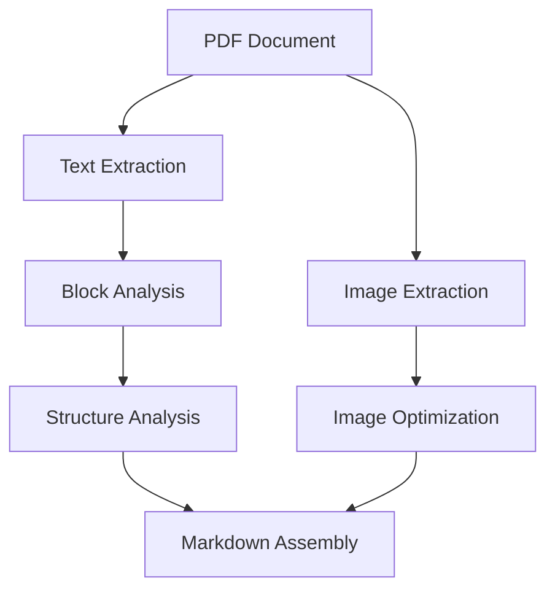
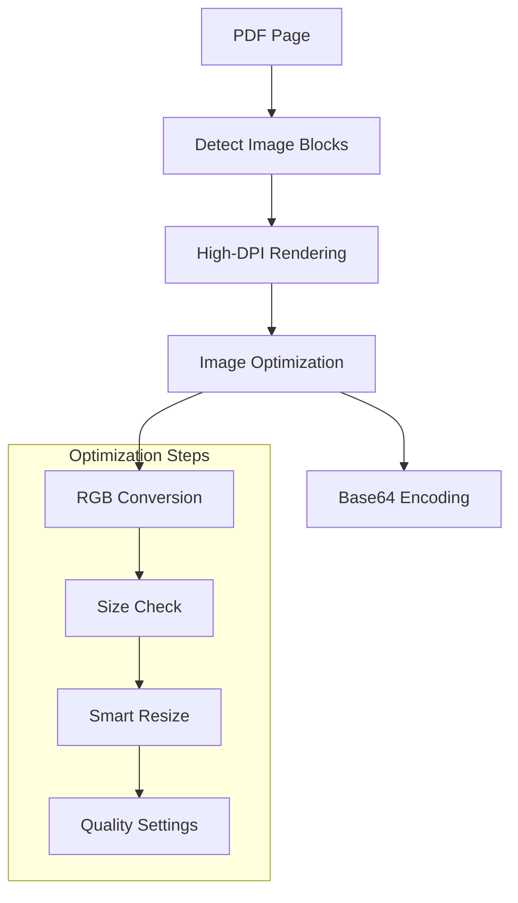
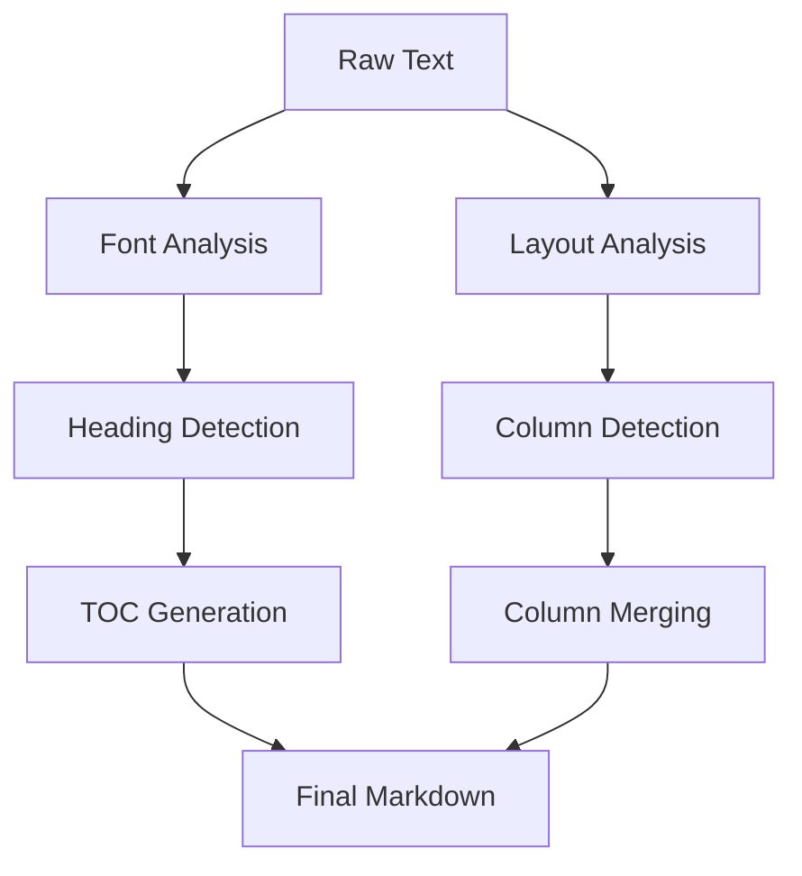

# System Architecture and Patterns

## Core Components

### 1. PDF Processing Pipeline


### 2. Image Processing Strategy


### 3. Text Processing Flow


## Key Design Patterns

### 1. Image Processing
- **High-Resolution First**: Capture at 300 DPI for quality preservation
- **Block-Based Extraction**: Focus on image blocks rather than embedded images
- **Smart Padding**: Add padding to ensure complete image capture
- **Temporary File Management**: Clean handling of intermediate files
- **Quality-Size Balance**: Optimize based on content type and size

### 2. Text Structure
- **Font-Based Analysis**: Use font information for structure detection
- **Block Positioning**: Track relative positions for layout preservation
- **Column Detection**: Smart handling of multi-column layouts
- **Natural Reading Order**: Maintain logical content flow

### 3. Resource Management
- **Temporary Files**: Use system temp directory with proper cleanup
- **Memory Efficiency**: Process images in chunks
- **Error Recovery**: Graceful handling of processing failures
- **Resource Cleanup**: Guaranteed cleanup through try-finally blocks

## Implementation Guidelines

### 1. Image Handling
```python
# Image extraction pattern
def extract_images(page):
    # 1. Get page dimensions
    # 2. Detect image blocks
    # 3. High-DPI rendering
    # 4. Optimize and encode
    # 5. Clean up resources
```

### 2. Text Processing
```python
# Text block analysis pattern
def process_text_blocks(blocks):
    # 1. Extract text and fonts
    # 2. Detect structure
    # 3. Handle columns
    # 4. Preserve positions
```

### 3. Resource Management
```python
# Resource handling pattern
with tempfile.TemporaryDirectory() as temp_dir:
    try:
        # Process resources
    finally:
        # Cleanup
```

## Error Handling Strategy

### 1. Image Processing Errors
- Graceful fallback for failed extractions
- Clear error messages for debugging
- Continue processing remaining images
- Maintain document structure

### 2. Text Processing Errors
- Preserve partial results
- Fall back to simpler processing
- Maintain document readability
- Log issues for debugging

### 3. Resource Errors
- Proper cleanup in all cases
- Fallback strategies for failures
- Clear error reporting
- Recovery mechanisms

## Performance Considerations

### 1. Image Processing
- Batch processing for efficiency
- Smart quality/size tradeoffs
- Proper resource cleanup
- Memory-efficient operations

### 2. Text Processing
- Efficient block analysis
- Smart structure detection
- Optimized column handling
- Memory-conscious operations

### 3. Overall System
- Proper resource management
- Efficient file handling
- Clear error boundaries
- Performance monitoring
