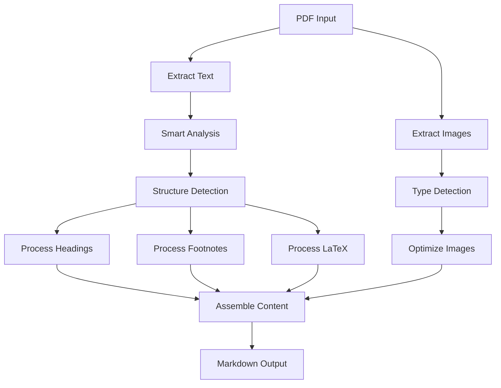

# System Architecture and Patterns

## Core Architecture
1. Three-Stage Pipeline
   ```mermaid
   flowchart LR
     PDF[PDF Input] --> Extract[Content Analysis]
     Extract --> Process[Smart Processing]
     Process --> Output[Content Assembly]
   ```

2. Component Structure
   ```mermaid
   flowchart TD
     CLI[CLI Interface] --> Converter[PDF Converter]
     Web[Web Interface] --> Converter
     Converter --> ImageProc[Image Processor]
     Converter --> LatexProc[LaTeX Processor]
     Converter --> FootnoteProc[Footnote Processor]
     Converter --> HeadingProc[Heading Processor]
     Converter --> MarkdownAssembler[Markdown Assembler]
   ```

## Key Design Patterns
1. Smart Processing Pattern
   - Image type detection
   - Context-aware settings
   - Quality optimization
   - Position awareness

2. Element Strategy
   - Image handling
   - LaTeX processing
   - Footnote detection
   - Heading recognition

3. Assembly Pattern
   - Content ordering
   - Structure preservation
   - TOC generation
   - Reference linking

## Data Flow


## Component Responsibilities
1. PDFConverter
   - Orchestration
   - Content extraction
   - Component coordination
   - Output assembly

2. ImageProcessor
   - Type detection
   - Quality optimization
   - WebP compression
   - Position handling

3. LatexProcessor
   - Equation detection
   - Format conversion
   - Syntax preservation
   - Style maintenance

4. FootnoteProcessor
   - Reference detection
   - Link generation
   - Content preservation
   - Multi-page handling

5. HeadingProcessor
   - Level detection
   - Structure analysis
   - TOC generation
   - Hierarchy preservation

6. MarkdownAssembler
   - Content organization
   - Format application
   - Structure preservation
   - Reference linking

## Error Handling
1. Recovery Strategy
   ```mermaid
   flowchart TD
     Error[Error Detected] --> Analyze[Analyze Type]
     Analyze --> Image[Image Error]
     Analyze --> Process[Process Error]
     Image --> Log[Log Error]
     Image --> Continue[Continue Processing]
     Process --> Log
     Process --> Skip[Skip Component]
     Log --> Report[Report to User]
   ```

2. Validation Points
   - Image processing
   - LaTeX conversion
   - Footnote linking
   - Heading structure

## Performance Patterns
1. Efficient Processing
   - Smart type detection
   - Optimized validation
   - Minimal transformations
   - Streaming operations

2. Resource Management
   - Memory optimization
   - Efficient encoding
   - Progressive loading
   - Resource cleanup

## Web Interface Pattern
1. Component Flow
   ```mermaid
   flowchart LR
     Upload[File Upload] --> Validate[Validation]
     Validate --> Convert[Conversion]
     Convert --> Preview[Preview]
     Preview --> Download[Download]
   ```

2. User Interaction
   ```mermaid
   flowchart TD
     Drop[Drag & Drop] --> Process[Processing]
     Process --> Progress[Show Progress]
     Progress --> Result[Show Result]
     Result --> Actions[User Actions]
   ```

## Current Implementation
1. Processing Flow
   ```mermaid
   flowchart LR
     Input[Input] --> Smart[Smart Processing]
     Smart --> Structure[Structure Analysis]
     Structure --> Assembly[Assembly]
     Assembly --> Output[Output]
   ```

2. Web Flow
   ```mermaid
   flowchart TD
     Upload[Upload] --> Validate[Validate]
     Validate --> Process[Process]
     Process --> Preview[Preview]
     Preview --> Actions[Actions]
   ```

3. Next Features
   ```mermaid
   flowchart TD
     Current[Current] --> ErrorHandling[Error Handling]
     Current --> ImageProcessing[Image Processing]
     Current --> UserFeedback[User Feedback]
