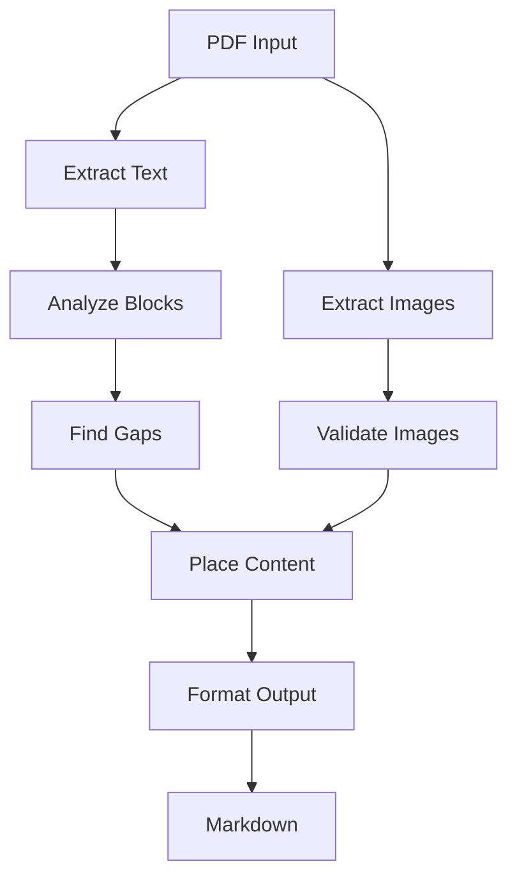

# System Architecture and Patterns

## Core Architecture
1. Three-Stage Pipeline
   ```mermaid
   flowchart LR
     PDF[PDF Input] --> Extract[Content Analysis]
     Extract --> Process[Gap Detection]
     Process --> Output[Content Assembly]
   ```

2. Component Structure
   ```mermaid
   flowchart TD
     CLI[CLI Interface] --> Converter[PDF Converter]
     Converter --> TextProc[Text Processor]
     Converter --> ImageProc[Image Processor]
     Converter --> GapAnalyzer[Gap Analyzer]
     Converter --> MarkdownAssembler[Markdown Assembler]
   ```

## Key Design Patterns
1. Gap Analysis Pattern
   - Text block detection
   - Gap measurement
   - Content positioning

2. Element Strategy
   - Text block handling
   - Image validation
   - Footnote detection
   - LaTeX processing

3. Assembly Pattern
   - Content ordering
   - Gap-based placement
   - Structure preservation

## Data Flow


## Component Responsibilities
1. PDFConverter
   - Orchestration
   - Content extraction
   - Gap analysis
   - Assembly

2. ImageProcessor
   - Image extraction
   - Size validation
   - Format conversion
   - Position analysis

3. GapAnalyzer
   - Text block analysis
   - Gap detection
   - Content placement
   - Structure preservation

4. MarkdownAssembler
   - Text formatting
   - Image embedding
   - LaTeX conversion
   - Footnote handling

## Error Handling
1. Recovery Strategy
   ```mermaid
   flowchart TD
     Error[Error Detected] --> Analyze[Analyze Type]
     Analyze --> Image[Image Error]
     Analyze --> Text[Text Error]
     Image --> Skip[Skip Image]
     Text --> Continue[Continue Text]
     Skip --> Log[Log Error]
     Continue --> Log
   ```

2. Validation Points
   - Image size checks
   - Gap measurements
   - Text block validation
   - LaTeX syntax

## Performance Patterns
1. Efficient Processing
   - Smart gap detection
   - Optimized validation
   - Minimal transformations

2. Resource Management
   - Streaming processing
   - Memory optimization
   - Efficient encoding

## Current Implementation
1. Content Flow
   ```mermaid
   flowchart LR
     Extract[Extract] --> Analyze[Analyze]
     Analyze --> Place[Place]
     Place --> Format[Format]
   ```

2. Image Processing
   ```mermaid
   flowchart TD
     Image[Extract] --> Validate[Validate]
     Validate --> Size[Check Size]
     Size --> Context[Check Context]
     Context --> Place[Place Image]
   ```

3. Next Features
   ```mermaid
   flowchart TD
     Current[Current] --> Small[Small Images]
     Current --> Footnotes[Footnotes]
     Current --> LaTeX[LaTeX Support]
   ```
